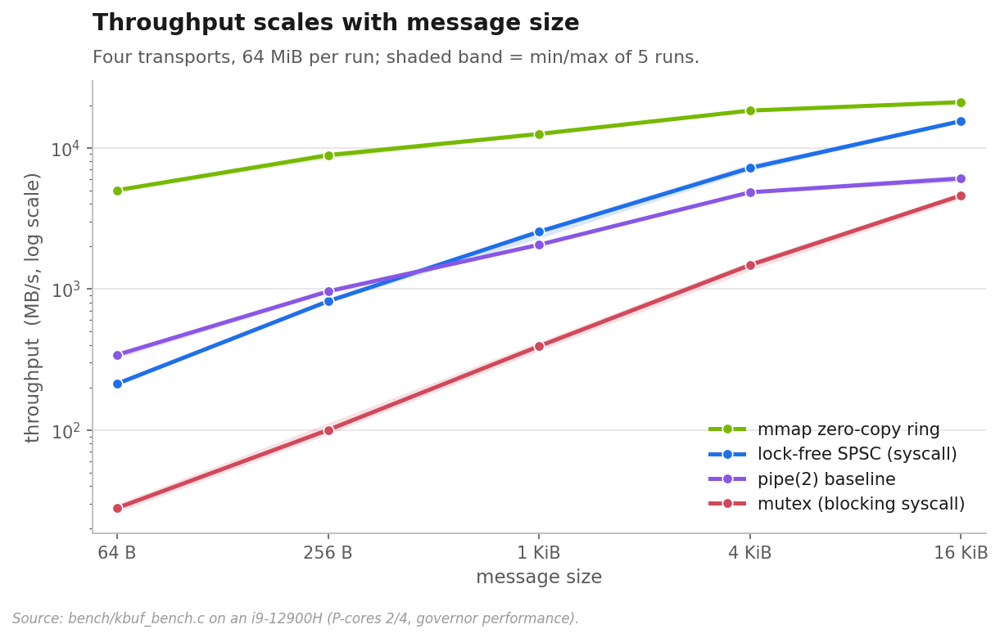
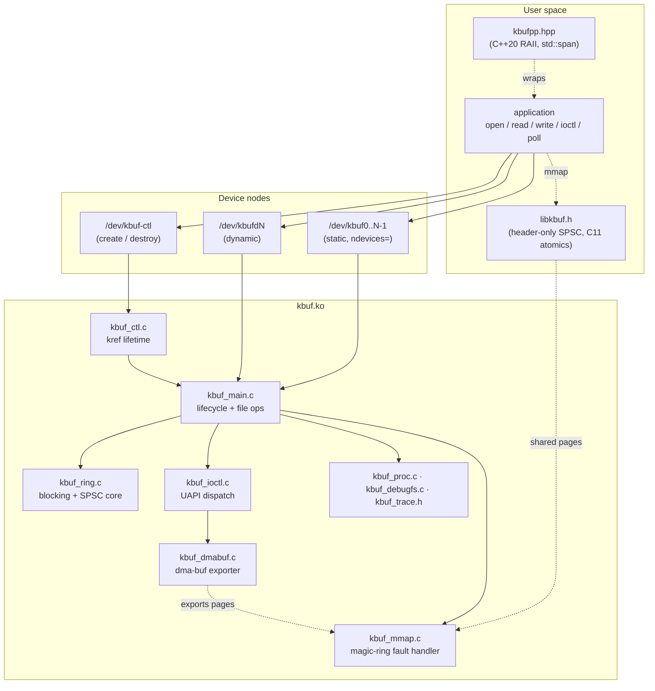
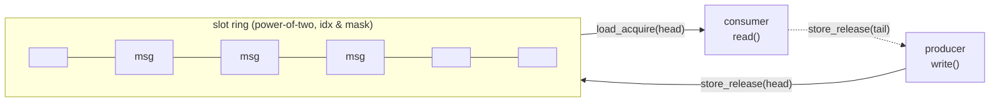
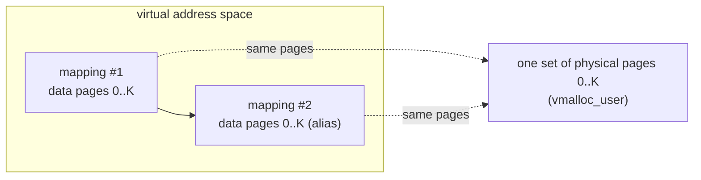
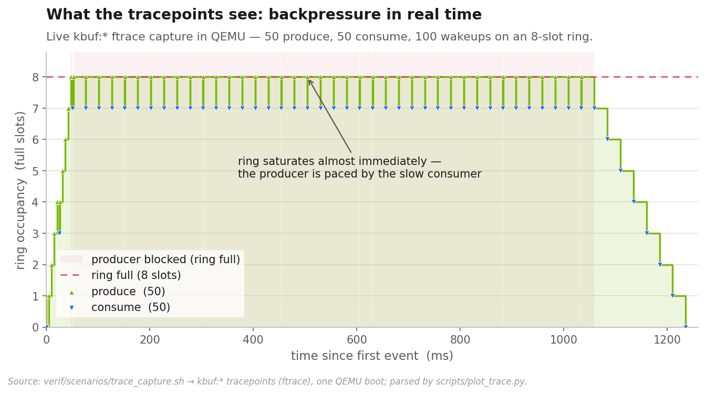
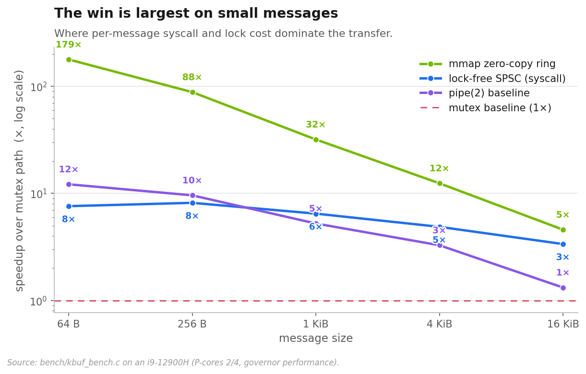
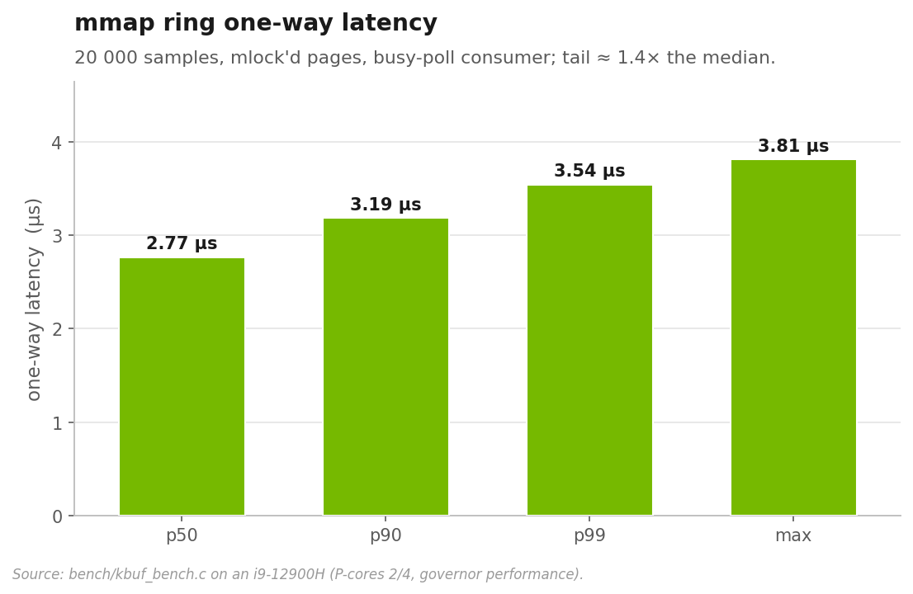

# kbuf — a high-performance Linux producer/consumer character device

A self-contained, out-of-tree Linux kernel module that takes the classic
producer/consumer character device and pushes it to its limits: multiple
character devices, a versioned ioctl ABI, a lock-free SPSC mode, an **mmap
zero-copy "magic ring"** that moves data with *no syscalls on the hot path*,
observability via debugfs and perf tracepoints, a kselftest-style suite run
under QEMU, and a benchmark report with reproducible numbers.

[](https://github.com/goanarbolkong/kbuf-driver/actions/workflows/ci.yml)


## Highlights

- **Four transports, one driver.** A blocking mutex slot ring, a **lock-free
  SPSC** slot ring (`smp_store_release`/`smp_load_acquire`, power-of-two masked
  indices), and an **mmap zero-copy ring** — benchmarked head-to-head against a
  `pipe(2)` baseline.
- **mmap "magic ring buffer."** The data ring is double-mapped into adjacent
  virtual addresses so a record that wraps the end is still **contiguous** in the
  reader's address space — no split copy, ever. Userspace drives it through the
  header-only `libkbuf` SPSC library with C11 atomics.
- **Real UAPI.** Versioned ioctl interface (`KBUF_IOCGSTATS`, `KBUF_IOCRESIZE`,
  `KBUF_IOCRESET`, `KBUF_IOCSMODE`) plus per-device throughput stats.
- **dma-buf interop.** `KBUF_IOCEXPORT` hands the data ring to other subsystems
  as a **dma-buf** fd — the same pages the mmap ring uses, so a dma-buf importer
  and an `mmap()` alias one buffer with no copy. The exporter implements the
  full `attach`/`map_dma_buf`/`vmap`/`mmap` contract; an in-kernel importer
  self-test exercises the device-attach path no userspace test can reach, and a
  `kref` keeps the buffer alive after the originating fd (or device) is gone.
- **Modern C++ veneer.** `include/kbufpp.hpp` — a header-only **C++20 RAII**
  wrapper: move-only `Device` / `MappedRing` / `unique_fd` handles, a
  `std::span<std::byte>` API, `std::system_error` on failure, zero overhead over
  the C ABI. Covered by a **GoogleTest** suite run inside the same QEMU VM.
- **Multiple instances.** `ndevices=` static minors *and* a `/dev/kbuf-ctl`
  control device for runtime create/destroy with **kref lifetime** (destroy is
  safe while a device is still open).
- **Observable.** Per-device counters under `/sys/kernel/debug/kbuf/` and
  `TRACE_EVENT` tracepoints usable with `perf record -e 'kbuf:*'`.
- **Verified, not vibes.** A **pytest verification framework** boots one
  disposable QEMU VM per test — parameterized boot matrix, structured serial
  markers, per-test console/dmesg artifacts, JUnit output — so an oops costs a
  failed test, never the workstation. CI runs `checkpatch --strict`, `sparse`,
  a build matrix, and the QEMU suite. Benchmarks documented with full
  methodology.

## Headline numbers

On bare metal (i9-12900H, governor `performance`, producer/consumer pinned to two
distinct P-cores), the mmap zero-copy ring moves small messages **~180× faster**
than the blocking syscall path, and the lock-free SPSC ring is **~5× faster** —
because the wins come from removing the per-message syscall and lock, which
matters most when messages are small.



| transport | 64 B | 4 KiB | 16 KiB | one-way latency (p50) |
|---|--:|--:|--:|--:|
| mmap zero-copy | **5.0 GB/s** | 18.3 GB/s | 21.0 GB/s | **2.8 µs** |
| lock-free SPSC | 213 MB/s | 7.2 GB/s | 15.4 GB/s | — |
| pipe(2) | 341 MB/s | 4.8 GB/s | 6.1 GB/s | — |
| mutex syscall | 28 MB/s | 1.5 GB/s | 4.6 GB/s | — |

Full methodology, error bars, latency percentiles, and the false-sharing
experiment are in **[docs/BENCHMARKS.md](docs/BENCHMARKS.md)**.

## Architecture



## The ring buffers

**Blocking / SPSC slot ring.** A fixed array of message slots with head/tail
indices. The blocking mode serialises with a mutex and parks callers on two wait
queues (full → producer sleeps, empty → consumer sleeps). The SPSC mode drops the
lock entirely: free-running 64-bit indices, `slot = idx & (n-1)`, paired
release/acquire so the consumer never sees a slot before its payload is visible.



**The magic ring (mmap).** The data ring's physical pages are mapped **twice**,
back to back, in the process's address space. A reader at offset *o* with a record
that runs past the end simply keeps reading into the second mapping — which aliases
the same pages from the start — so every record is one contiguous `memcpy`, no
wrap-around split. A separate control page carries `head`/`tail` on **distinct
cache lines** to avoid false sharing.



See **[docs/DESIGN.md](docs/DESIGN.md)** for a paragraph per design decision and
**[docs/DEBUGGING.md](docs/DEBUGGING.md)** for the running log of bugs hunted
(including a use-after-free in the kref release path that QEMU caught before the
host ever saw it).

## Observability

The driver carries `TRACE_EVENT` tracepoints and per-device debugfs counters
(Phase 7). The figure below is **not a mock-up** — it is a live `kbuf:*` ftrace
capture from one QEMU boot, a fast producer against a slow consumer on the
8-slot blocking ring. Each produce/consume event reports the resulting
occupancy, so plotting the stream over time shows the ring saturate within
milliseconds and then stay pinned at its depth: the producer is **blocked on
backpressure**, paced one slot at a time by the consumer, until the final drain.



Capture + plot it yourself with `python3 scripts/plot_trace.py` (boots a VM,
enables the tracepoints, runs the workload, renders the figure).

## Build

```sh
make            # builds kbuf.ko + the user-space test/bench programs
make sparse     # static analysis (make C=2)
make checkpatch # kernel coding-style check (--strict)
make bench      # build bench/kbuf_bench
make gtest cpp  # fetch + build GoogleTest, then the kbuf++ test binary
```

## Run & test

Experimental builds are validated **under QEMU**, never insmod'd directly on the
development host. The pytest framework boots one throwaway VM per test (~18 s
for the whole suite with KVM) and captures per-test console + dmesg artifacts:

```sh
make verif                            # full suite, JUnit XML to .qemu/verif.xml
python3 -m pytest verif -k spsc -q    # or any pytest selection
scripts/run-qemu.sh                   # zero-dependency single-boot fallback
```

See **[docs/VERIFICATION.md](docs/VERIFICATION.md)** for the architecture
(cmdline-driven guest, structured serial markers, boot matrix).

On a machine where host loading is acceptable, `make load` / `make unload` are
provided; Secure Boot hosts require the module to be MOK-signed first
(`scripts/sign_and_load.sh`).

Reproduce the benchmarks and regenerate the figures:

```sh
scripts/run-baremetal-bench.sh   # sign + pin governor + load + bench + teardown
python3 scripts/plot_bench.py    # regenerate the benchmark figures (recorded run)
python3 scripts/plot_trace.py    # capture a live ftrace timeline under QEMU + plot
```

## Benchmarks

| | |
|---|---|
|  |  |

The relative speedup over the mutex path shrinks as messages grow — once the
per-message syscall cost amortises, every transport trends toward memory-copy
bandwidth, so the interesting regime is small messages. One-way mmap latency is
~2.8 µs at the median with a tight tail (max only ~1.4× the median). The
control-page cache-line separation is justified by a [standalone false-sharing
experiment](docs/BENCHMARKS.md#false-sharing--store-only-vs-atomic-rmw): putting
two cores' counters on the same line vs separate lines costs **4.9×** under
atomic read-modify-writes (1.2× for plain stores).

## Layout

```
include/kbuf.h        user/kernel ABI (ioctl numbers, kbuf_stats, mmap ctrl)
include/libkbuf.h     user-space lib for the mmap zero-copy ring (SPSC)
include/kbufpp.hpp    C++20 RAII wrapper (move-only handles, std::span API)
src/kbuf_main.c       module lifecycle + file operations (blocking + SPSC)
src/kbuf_ring.c       circular-buffer core: blocking + lock-free SPSC mechanics
src/kbuf_proc.c       /proc/kbuf_status
src/kbuf_ioctl.c      ioctl dispatch (stats, resize, reset, mode, export/import)
src/kbuf_mmap.c       mmap + magic-ring double-mapping fault handler
src/kbuf_debugfs.c    /sys/kernel/debug/kbuf/kbufN/ counter files
src/kbuf_ctl.c        /dev/kbuf-ctl: runtime create/destroy (kref lifetime)
src/kbuf_dmabuf.c     dma-buf exporter + in-kernel importer self-test
src/kbuf_trace.h      TRACE_EVENT definitions (perf record -e 'kbuf:*')
src/kbuf_internal.h   in-kernel types and cross-file prototypes
tests/                user-space functional + stress tests (.c) + kbuf++ (.cpp)
verif/                pytest verification framework (boots one VM per test)
bench/                throughput benchmarks (kbuf_bench: mmap vs syscall)
docs/                 DESIGN.md, DEBUGGING.md, BENCHMARKS.md, VERIFICATION.md
scripts/              QEMU harness, bare-metal bench, signing, plotting, gtest
```

## Status

| Phase | Feature | State |
|-------|---------|-------|
| 1 | Multi-file restructure + UAPI scaffold | ✅ done |
| 2 | poll/epoll + QEMU test harness | ✅ done (verified under QEMU) |
| 3 | ioctl UAPI (resize, stats, reset, mode) | ✅ done (verified under QEMU) |
| 4 | Multiple instances (N minors, `ndevices=`) | ✅ done (verified under QEMU) |
| 4+ | Dynamic create/destroy via `/dev/kbuf-ctl` (kref) | ✅ done (stretch, verified under QEMU) |
| 5 | Lock-free SPSC mode | ✅ done (verified under QEMU) |
| 6 | mmap zero-copy ring (magic ring + libkbuf) | ✅ done (verified under QEMU) |
| 7 | debugfs + tracepoints | ✅ done (verified under QEMU) |
| 8 | functional suite + CI | ✅ done (suite verified under QEMU) |
| 9 | Benchmark report | ✅ done (docs/BENCHMARKS.md) |
| 10 | pytest QEMU verification framework | ✅ done (docs/VERIFICATION.md) |
| 11 | KCSAN/KASAN/lockdep gates + fault injection | ✅ done (CI `gates` job, docs/VERIFICATION.md) |
| 12 | C++20 RAII library (kbuf++) + GoogleTest | ✅ done (verified under QEMU) |
| 13 | dma-buf exporter (`KBUF_IOCEXPORT`) | ✅ done (verified under QEMU) |

Design rationale for every major decision lives in
[`docs/DESIGN.md`](docs/DESIGN.md); the bugs worth remembering are written up
in [`docs/DEBUGGING.md`](docs/DEBUGGING.md).

## License

GPL-2.0. See [LICENSE](LICENSE); every source file carries an SPDX identifier.
