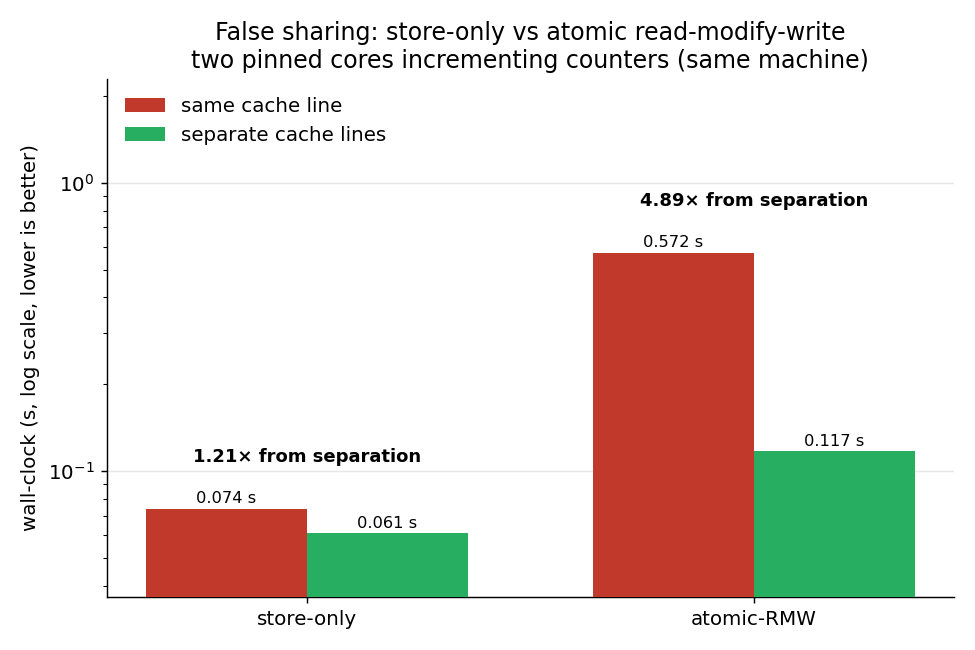

# kbuf — Benchmarks

Throughput, latency, and a false-sharing experiment for the kbuf transports,
produced by `bench/kbuf_bench.c`.

## Environment

| | |
|---|---|
| Host       | bare metal (not a VM) |
| CPU        | 12th Gen Intel Core i9-12900H (6 P-cores + 8 E-cores, 20 threads) |
| Kernel     | 6.17.0-35-generic (x86-64) |
| Memory     | 15 GiB |
| Governor   | `performance` (pinned via `cpupower frequency-set -g performance`) |
| Placement  | producer→CPU 2, consumer→CPU 4 — two **distinct physical P-cores** (core ids 4 and 8) |
| Anti-noise | `mlockall(MCL_CURRENT \| MCL_FUTURE)` to exclude paging; idle desktop |

Reproduce with `scripts/run-baremetal-bench.sh` (signs the module under Secure
Boot, pins the governor, loads, runs `bench/kbuf_bench full`, and always tears
down). The script defaults to CPUs 2 and 4; override with `KBUF_BENCH_CPU_A` /
`KBUF_BENCH_CPU_B`. The figures below are regenerated from this run's recorded
numbers with `python3 scripts/plot_bench.py` (the dataset is embedded in that
script; update it when you re-bench).

> **Why two distinct physical cores matters.** The benchmark pins the producer
> and consumer to separate CPUs. On an SMT machine the *naive* choice of CPU 0
> and CPU 1 lands on two **hyperthread siblings of one physical core**, which
> share an L1/L2 and an execution backend — that both inflates small-message
> throughput (the ring handoff never leaves L1) and corrupts the false-sharing
> experiment (no inter-core line to bounce). We therefore pin to CPU 2 and CPU 4,
> which are separate P-cores. This was found the hard way: see
> `docs/DEBUGGING.md`.

## Methodology

- **Transports.** `mutex` = slot ring in blocking mode via `read()/write()`;
  `spsc` = slot ring in lock-free SPSC mode via `read()/write()`; `mmap` = the
  zero-copy ring via `libkbuf` (no syscalls on the data path); `pipe` = a
  `pipe(2)` baseline.
- **Topology.** One producer process and one consumer process, pinned to two
  distinct physical P-cores with `sched_setaffinity` (`bench/kbuf_bench.c`).
- **Throughput.** Move a fixed total (64 MiB) in fixed-size chunks; sweep the
  chunk size; report MB/s = total / wall-clock. The headline table below is a
  clean **min/avg/max over 5 runs** pass; the current tool also reports
  **mean ± sample stddev** (now the default, 10 runs) — see *Threats to
  validity* on why this thermally-constrained laptop does not yield a stable
  stddev pass. For the slot transports the device is resized so one slot holds
  one message.
- **Latency.** One-way producer→consumer latency on the mmap ring: the producer
  stamps `CLOCK_MONOTONIC` into each 8-byte message, the consumer subtracts on
  receipt. 20 000 samples, sorted for percentiles. All pages are `mlock`ed so
  no sample includes a page fault.
- **False sharing.** Two pinned processes each increment a counter in a shared
  page for a fixed number of iterations, once with the counters on the **same**
  cache line and once on **separate** lines; compare wall-clock. Run for two
  access patterns: plain **store-only** increments (200 Mi/core) and **atomic
  read-modify-writes** (`LOCK XADD`, 25 Mi/core).
- Build with `make bench`, then `./bench/kbuf_bench full` on a host with the
  module loaded (`/dev/kbuf0..2`), or use `scripts/run-baremetal-bench.sh`.

## Throughput (MB/s), 64 MiB per run, 5 runs (min/avg/max)

| chunk |        mutex |          spsc |              mmap |          pipe |
|------:|-------------:|--------------:|------------------:|--------------:|
|   64 B|   26/  28/ 30|  206/ 213/ 219|  4876/ 5002/ 5156 |  321/ 341/ 354|
|  256 B|   93/ 100/112|  800/ 817/ 840|  8354/ 8850/ 9341 |  934/ 960/1001|
| 1024 B|  363/ 392/422| 2279/2539/2654| 12238/12522/12923 | 2014/2053/2088|
| 4096 B| 1347/1473/1564| 6846/7182/7648| 17953/18325/18726 | 4762/4830/4987|
|16384 B| 4332/4582/4809|15098/15423/15642|20648/21030/21269 | 5741/6051/6413|

## Latency — mmap ring, one-way (ns), 20 000 samples

| p50  | p90  | p99  | max  |
|-----:|-----:|-----:|-----:|
| 2765 | 3185 | 3545 | 3811 |

The tail is tight — the maximum is only ~1.4× the median — because the pages
are `mlock`ed and the busy-poll consumer runs uncontended on its own physical
core. (An earlier loaded-desktop run reported a p50 of ~32 µs; that was pure
host noise from preemption and swapping, not the transport. Pinning, `mlockall`,
and a quiet machine collapsed it.)

## False sharing — store-only vs atomic RMW

| access pattern | same line | separate lines | separation speedup |
|----------------|----------:|---------------:|-------------------:|
| store-only (200 Mi/core)  | 0.074 s | 0.061 s | **1.21×** |
| atomic-RMW (25 Mi/core)   | 0.572 s | 0.117 s | **4.87×** |

Two cores writing different variables that share one cache line bounce the line
between their L1s; padding them onto separate lines removes that coherence
traffic. **How much it costs depends entirely on the access pattern:**

- With **plain stores** the penalty is modest (~1.21×). Each core only *stores*
  (never reads the sibling's value), so its store buffer lets it retain the line
  for a burst of writes before the other steals it — the line still bounces, but
  amortised across a burst.
- With an **atomic read-modify-write** (`LOCK XADD`) the penalty is large
  (~4.87×). Every single increment must acquire the line in *exclusive* state, so
  a shared line ping-pongs between the two L1s on **every** op — there is no
  burst to amortise. This is the textbook false-sharing cost.

Both directions are the same lesson, and it is exactly why the mmap control page
keeps `head` and `tail` on separate cache lines: a producer publishing `head`
and a consumer publishing `tail` must never contend for one line. (These
counters use release stores, not RMWs, so the real ring sits nearer the
store-only case — but the atomic experiment shows how sharp the cliff becomes
the moment a contended atomic is involved.)

## Discussion

- **mmap dominates, most at small messages.** At 64 B the mmap ring moves ~5.0
  GB/s versus ~28 MB/s for the mutex syscall path — roughly **180×** — because it
  pays no syscall or `copy_*_user` per message; the cost is a `memcpy` plus two
  atomics. As the chunk grows the per-message syscall overhead amortises and the
  gap narrows (mmap is ~4.6× the mutex path at 16 KB), with all transports
  trending toward memory-copy bandwidth.
- **Lock-free SPSC beats the mutex path** at every size (e.g. ~4.9× at 4 KB),
  still over the syscall boundary — it just removes the per-op mutex
  lock/unlock and the contention between producer and consumer.
- **`pipe(2)` sits between them**: a well-tuned kernel path, faster than the
  mutex slot ring at small sizes but well short of mmap, and below SPSC once
  messages are large enough to amortise the syscall.
- **Latency.** One-way handoff over the shared-memory ring is ~2.8 µs at the
  median with a very tight tail — dominated by the cross-core cache-line
  transfer plus busy-poll wakeup, with no syscall in the path.
- **Takeaway.** For high message rates the syscall and the in-kernel lock are
  the costs that matter; removing the syscall (mmap) wins big at small sizes,
  and removing the lock (SPSC) is a solid mid-ground when a syscall interface is
  still required. Cache-line hygiene on the shared control words is worth a
  measurable amount on its own.

## Threats to validity / future work

- Single dual-core placement (one P-core pair); no NUMA dimension on this
  single-socket laptop part. A server run across sockets would add a NUMA
  placement sweep.
- **Host stability bounds the throughput/latency numbers.** The headline table
  is a clean min/avg/max pass. The tool now reports mean ± stddev over 10 runs,
  but on this laptop back-to-back `performance`-governor passes drive thermal
  throttling and the desktop steals the pinned P-cores: repeat passes showed the
  mmap@64 B cell swing from ~5.0 GB/s down to ~1.0 GB/s and the mmap latency p50
  balloon from ~2.8 µs to ~39 µs — host noise, not the transport. Stable stddev
  bars need a quiesced, thermally-headroomed machine (a server, `isolcpus` +
  `nohz_full`, or a cooled bench), which is the right place to redo this.
- Bandwidth, not goodput, at large sizes — all transports approach the same
  `memcpy` ceiling, so the interesting regime is small messages.
- P-core vs E-core placement is unexplored; all numbers here are P-core to
  P-core.
