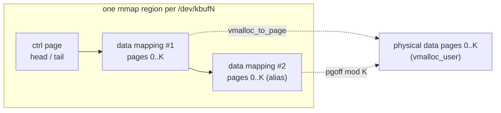

# kbuf — Design Notes

This document records non-trivial design decisions. Each entry states the
decision, the alternatives considered, and the rationale.

## 1. Multi-file module layout (Phase 1)

**Decision.** Split the original single `kbuf_driver.c` into a small set of
translation units linked into one module object (`kbuf.ko`):

- `src/kbuf_main.c` — module init/exit and the `file_operations` (open,
  release, read, write, ioctl wiring). Owns blocking and wakeup policy.
- `src/kbuf_ring.c` — the circular-buffer core: slot copy and index advance.
- `src/kbuf_proc.c` — the `/proc/kbuf_status` view.
- `src/kbuf_ioctl.c` — ioctl command dispatch.
- `src/kbuf_internal.h` — in-kernel types and cross-file prototypes.
- `include/kbuf.h` — the user/kernel ABI, included by both sides.

**Rationale.** Later phases (poll, ioctl handlers, multiple instances,
lock-free mode, mmap) each touch a distinct concern. Separating them now keeps
each file small enough to reason about and review, and forces a clean line
between the ring mechanics and the syscall/policy layer.

**Locking boundary.** The ring helpers (`kbuf_ring_*`) assume the caller holds
`dev->lock` and has already checked the empty/full predicate. Blocking
(`wait_event_interruptible`), `O_NONBLOCK` handling, and wakeups stay entirely
in `kbuf_main.c`. This keeps `kbuf_ring.c` a pure data-structure module with no
scheduling policy baked in — important for the Phase 5 lock-free variant, which
will replace the mechanics without touching the policy layer.

**Per-device pointer, not a global reach-in.** Even though a single global
`struct kbuf_dev kbuf` backs `/dev/kbuf` today, every ring/proc/ioctl helper
takes an explicit `struct kbuf_dev *`. Phase 4 (one device per minor) then
becomes a wiring change in `kbuf_main.c` rather than a rewrite of the core.

**Build split.** `Kbuild` declares the module object layout for the kernel
build system; the top-level `Makefile` is the human entry point and also hosts
the `sparse` and `checkpatch` quality gates. Keeping them separate avoids the
kernel build system trying to parse host-make targets.

## 2. UAPI ABI (Phase 1 scaffold, Phase 3 implementation)

`include/kbuf.h` commits the ioctl command numbers (magic `'k'`) and the
`kbuf_stats` / `kbuf_resize` layouts now, so user space can be written against a
stable interface before the kernel-side handlers land. The dispatcher in
`kbuf_ioctl.c` validates the command encoding and returns `-ENOSYS` for
recognised-but-unimplemented commands (vs `-ENOTTY` for unknown ones).

**ABI policy.** Fixed-width types throughout. New fields are appended, never
reordered or resized. The `kbuf_stats` struct is the versioning vehicle if the
interface must grow.

## 3. poll/select/epoll support (Phase 2)

**Decision.** Implement `.poll` by registering the caller on *both* wait queues
with `poll_wait()` and returning `EPOLLIN | EPOLLRDNORM` while the ring is
non-empty and `EPOLLOUT | EPOLLWRNORM` while it is non-full.

**Why both queues.** A poller waiting only for readability still needs to be
woken when the ring transitions full → not-full if it also asked for
writability, and vice versa. `kbuf_read` wakes `write_wq` and `kbuf_write`
wakes `read_wq` on every state change, so registering on both queues guarantees
the poller is woken for either edge regardless of which event it is waiting on.
`poll_wait()` only enqueues the task — it never sleeps — so briefly taking the
mutex afterwards for a consistent (empty, full) snapshot is safe in poll
context.

**Level-triggered semantics.** The mask reflects current state every call, so
both level-triggered (default) and edge-triggered (`EPOLLET`) epoll users behave
correctly: a reader that drains only part of the ring is re-notified on the next
`epoll_wait` because slots remain.

**Test.** `tests/test_poll.c` samples readiness with a zero-timeout `poll()`
across an empty → 1-message → full → drained progression, and confirms
`epoll_wait` reports `EPOLLIN` when data is present. It is self-contained and
runs unattended under the QEMU harness.

## 4. ioctl UAPI + throughput stats (Phase 3)

**Dynamic geometry.** Supporting `KBUF_IOCRESIZE` forces the ring to be
heap-allocated: the slot array (`kcalloc`) and each slot's data buffer
(`kmalloc`) are now allocated at load time from `num_buffers`/`buffer_size`
fields on the device, bounded by `KBUF_MAX_NUM_BUFFERS` (256) and
`KBUF_MAX_BUFFER_SIZE` (64 KiB). The fixed `[8][4096]` arrays are gone. Init
allocates the ring and the mutex/wait queues *before* `cdev_add`, so the device
is never reachable in a half-initialised state (a latent bug in the v1 ordering,
which called `mutex_init` after `device_create`).

**Resize policy: reject unless empty (`-EBUSY`).** When a resize is requested on
a non-empty ring, the call fails with `-EBUSY` rather than silently dropping or
truncating queued messages. This is the only policy that never loses data the
caller hasn't acknowledged; the caller drains and retries. The new slot array is
allocated *before* taking the lock, so the mutex is held only for the pointer
swap (not the allocation); the old array is freed after unlocking. Alternatives
considered: drain-then-resize (silent data loss) and preserve-as-much-as-fits
(surprising partial loss, and complex to copy across differing geometries).

**Reset semantics (`KBUF_IOCRESET`).** Zeroes the throughput counters and sets
`peak_count` to the current depth. It does *not* discard queued data — "reset
the statistics", not "flush the ring" — so it is safe to call on a live device.

**Stats are lifetime-cumulative and device-global.** Counters
(`bytes/msgs_produced/consumed`, `read/write_sleeps`, `peak_count`) live on the
device, updated under the same mutex as the ring, and persist across open/close.
They are surfaced both via `KBUF_IOCGSTATS` and the enriched `/proc/kbuf_status`.

**Mode (`KBUF_IOCSMODE`).** Validates the argument and stores it, but only
`KBUF_MODE_BLOCKING` is implemented; `KBUF_MODE_SPSC` returns `-EOPNOTSUPP`
until the lock-free path lands in Phase 5. Honest stub over a silent no-op.

**Test.** `tests/test_ioctl.c` covers GSTATS accounting across a known
produce/consume, RESET, RESIZE (empty OK / non-empty `-EBUSY` / bounds
`-EINVAL`), SMODE validation, and an unknown command (`-ENOTTY`). It restores
the default 8×4096 geometry and drains before exiting so later tests in the same
boot see a clean device.

## 5. Multiple instances (Phase 4)

**Decision.** Create `ndevices` independent character devices /dev/kbuf0..N-1
(module param, default 4, bounded by `KBUF_MAX_NDEVICES`). The single global
`struct kbuf_dev` becomes a heap array (`kcalloc`); one shared `struct class`
and one contiguous minor range (`alloc_chrdev_region(.., ndevices, ..)`) back
them all.

**Per-open routing.** `open()` recovers its device with
`container_of(inode->i_cdev, struct kbuf_dev, cdev)` and stores it in
`filp->private_data`; every read/write/poll/ioctl then operates on that device.
This is why Phase 1 deliberately threaded a `struct kbuf_dev *` through every
helper instead of reaching for a global — Phase 4 added the array and the
routing without touching the ring or ioctl logic at all.

**Independence.** Each device has its own ring, mutex, wait queues, geometry,
mode, and counters, so `/dev/kbuf0` and `/dev/kbuf1` share nothing.
`tests/test_multi.c` proves it: data written to kbuf0 is invisible to kbuf1,
counters are separate, and `KBUF_IOCRESIZE` on one leaves the other's geometry
untouched.

**Lifecycle / teardown.** Devices are created in a loop; on a mid-loop failure,
`kbuf_teardown_devices(i)` unwinds exactly the `i` fully-created devices, then
the class and region are released. Each loop iteration either fully succeeds or
frees its own partial allocations before unwinding, so there is no leak on any
error path. The same teardown runs on module exit.

**Init ordering safety carries over.** Each device's ring, mutex, and wait
queues are initialised before its `cdev_add`, so a device is never reachable
before it is fully constructed.

**Deferred (stretch).** The `/dev/kbuf-ctl` control device for dynamic
create/destroy with `kref` lifetime management is not implemented here; the
static `ndevices` set covers the Phase 4 requirement.

## 6. Lock-free SPSC mode (Phase 5)

**Decision.** Add a second ring discipline, selectable per device via
`KBUF_IOCSMODE`. In `KBUF_MODE_SPSC` the data path takes no mutex: it uses
free-running `prod_idx`/`cons_idx` into the existing slot array, with the slot
chosen by `idx & (num_buffers - 1)` — which is why SPSC requires a power-of-two
capacity (enforced by SMODE and RESIZE).

**Memory ordering.** The producer writes the slot, then publishes the head with
`smp_store_release(&prod_idx, prod + 1)`. The consumer observes it with
`smp_load_acquire(&prod_idx)`; the release/acquire pair guarantees the slot
contents are visible before the index that exposes them. The mirror image holds
for `cons_idx`: the consumer releases it after copying out, and the producer
acquires it before reusing a slot, so a slot is never overwritten while still
being read. `prod_idx` is written only by the producer and `cons_idx` only by
the consumer; each side reads its own index plainly. Correctness therefore
relies on exactly **one producer and one consumer** — this is documented as the
mode's contract, not enforced by the driver.

**Hybrid blocking.** The fast path is lock-free, but blocking semantics are
preserved: on an empty ring a reader (and on a full ring a writer) falls back to
`wait_event_interruptible` with check-sleep-recheck against the lock-free
predicate. Producers wake `read_wq` and consumers wake `write_wq` after each
operation. Wakeups are unconditional (they take the wait-queue lock) for
correctness; a `wq_has_sleeper`-style optimisation is possible but deferred.

**Not atomic-context safe.** `copy_to_user`/`copy_from_user` can fault and
sleep, so — exactly like the blocking path — the "lock-free" path is only safe
in process context. "Lock-free" refers to the absence of the ring mutex on the
fast path, not to atomic-context usability.

**Mode/geometry coupling.** SMODE switches only on an idle, empty ring (else
`-EBUSY`) and resets both index representations; the mutex it takes does not
exclude an in-flight lock-free operation, so the caller must also ensure no I/O
is in progress. RESIZE likewise rejects a non-power-of-two capacity while in
SPSC mode. `kbuf_occupancy()` reports depth correctly in either mode and is used
by `/proc` and `KBUF_IOCGSTATS`. SPSC counters are updated with `WRITE_ONCE` by
their single writer and observed without the global lock — best-effort, but
each field is read without tearing on 64-bit.

**Test.** `tests/test_spsc.c` switches a device to SPSC, forks a producer and a
consumer pinned to different CPUs, and pushes tens of thousands of sequenced,
pattern-filled messages through an 8-slot ring with blocking I/O — verifying
strict FIFO order and byte-for-byte integrity, and exercising the wait-queue
fallback heavily (the run logs thousands of producer sleeps). It restores
blocking mode before exiting.

## 7. mmap zero-copy ring — the "magic ring buffer" (Phase 6)

**Decision.** Give each device an mmap-able byte ring that user space drives
without syscalls on the data path. Two `vmalloc_user` buffers per device: a
one-page control block (`struct kbuf_mmap_ctrl`: head, tail, capacity) and a
`KBUF_MMAP_CAPACITY`-byte (64 KiB) data ring. `.mmap` exposes them as a single
region laid out `[ctrl page][data][data]`.

**The magic double mapping.** The data buffer is mapped *twice*, back to back.
The fault handler (`kbuf_vm_fault`) reduces the data page offset modulo the data
page count, so both virtual copies resolve to the same physical pages. A record
that wraps the end of the ring is therefore contiguous in the second copy, and
user space copies it with a single `memcpy` — no split at the boundary. Using a
`.fault` handler that returns `vmf->page` (via `vmalloc_to_page` + `get_page`)
is what makes the N-fold aliasing trivial; `remap_vmalloc_range` maps a region
once and cannot alias.

**Why it is shared.** Each `/dev/kbufN` is one `struct kbuf_dev`, so every
process that mmaps it faults to the *same* vmalloc pages. A producer and a
consumer in different processes thus share one ring with no extra setup — and a
child inherits the `MAP_SHARED` mapping across `fork()`.

**User-space SPSC (`include/libkbuf.h`).** head and tail are free-running byte
indices (slot = `index & (capacity - 1)`, capacity a power of two). The producer
publishes head with a release store after its `memcpy`; the consumer observes it
with an acquire load (mirror for tail). The header uses the GCC/Clang `__atomic`
builtins — the C11 acquire/release model applied directly to the shared plain
`__u64` fields. head and tail sit on separate cache lines in the control page to
avoid false sharing (measured in Phase 9). Single producer + single consumer is
the contract, matching the in-kernel SPSC mode.

**"Zero-copy" scope, stated honestly.** The data path takes no syscall and no
copy across the user/kernel boundary; the producer still `memcpy`s its payload
into the shared ring (and the consumer out). It is kernel-bypass for the
transfer, not elimination of the application's own copy.

**Lifetime.** The buffers are allocated per device at module load and freed in
teardown (and on every init error path). The mapping uses normal struct pages,
so unmapping and module unload are clean — verified by `rmmod` after the stress
test with no leak or oops.

**Test + benchmark.** `tests/test_mmap.c` forks a producer/consumer pinned to
different CPUs and streams 4 MiB through the 64 KiB ring (~64 wraps), verifying
every byte by absolute position to catch any loss, reorder, or wrap miscopy.
`bench/kbuf_bench.c` compares mmap throughput against the `read()`/`write()`
slot path; in-VM it shows roughly an order-of-magnitude speedup (illustrative —
the rigorous report with methodology is Phase 9).

## 8. Observability — debugfs + tracepoints (Phase 7)

**Tracepoints.** `src/kbuf_trace.h` defines events under the `kbuf` trace
system: `kbuf_produce` and `kbuf_consume` (a shared `DECLARE_EVENT_CLASS`
carrying device id, byte count, and resulting occupancy) and `kbuf_wakeup`
(device id + which queue was woken). They fire from the ring core and the
read/write wake sites, covering both blocking and SPSC modes, and are usable
with `perf record -e 'kbuf:*'` or via tracefs. The out-of-tree plumbing follows
`samples/trace_events`: one TU (`kbuf_main.c`) defines `CREATE_TRACE_POINTS`
before including the header, which sets `TRACE_INCLUDE_PATH .` (resolved through
the module's `-I$(src)/src`).

**debugfs.** `src/kbuf_debugfs.c` creates `/sys/kernel/debug/kbuf/kbufN/` with
one file per counter (msgs/bytes produced+consumed, sleeps, peak, indices,
geometry), wired straight to the device fields with `debugfs_create_u32/u64`.
These are read without the device lock — a best-effort live view, exact at rest.
It degrades to a no-op when `CONFIG_DEBUG_FS` is off.

**Why both.** Tracepoints answer "what happened, when, in what order" (per-event
stream, near-zero cost when disabled); debugfs answers "what is the state right
now" (cheap polling). The QEMU harness enables the tracepoints, runs the whole
suite, then confirms a debugfs counter advanced and that `kbuf_produce` events
landed in the trace buffer.

## 9. Test suite and CI (Phase 8)

**Coverage.** The functional suite spans the behaviours the project cares about:
blocking and `O_NONBLOCK` (`test_nonblock`), `poll`/`epoll` readiness
(`test_poll`), the ioctl UAPI incl. resize `-EBUSY`/`-EINVAL` races
(`test_ioctl`), per-device independence (`test_multi`), the lock-free SPSC path
under cross-core load (`test_spsc`), the mmap zero-copy ring (`test_mmap`),
partial-read datagram semantics and signal interruption → `EINTR`
(`test_edge`), and a producer/consumer round trip. The harness adds
**unload-under-load**: while an fd is open the module holds a reference, so
`rmmod` is correctly refused with `EBUSY` until the fd is released.

**CI (`.github/workflows/ci.yml`).** A gating `static` job runs
`checkpatch --strict`, builds the module + user-space programs, and runs sparse
(`make C=2`) against the runner's kernel headers — these are the hard gate and
pass cleanly. A second `qemu` job boots the module in a throwaway VM and runs
the suite; it is marked best-effort because hosted runners lack a readable
kernel image and KVM, but on a KVM-capable (e.g. self-hosted) runner it is the
real end-to-end check, reusing the same `scripts/run-qemu.sh` used locally. The
matrix is structured for multiple kernel-header versions; expanding it beyond
the runner's own kernel needs a runner with those headers installed.

## 10. Dynamic devices — /dev/kbuf-ctl (Phase 4 stretch)

**Decision.** A misc control device `/dev/kbuf-ctl` creates and destroys kbuf
devices at runtime: `KBUF_CTL_CREATE` returns a new id N (node `/dev/kbufdN`),
`KBUF_CTL_DESTROY` tears one down. Dynamic devices are heap-allocated, tracked
on a mutex-protected list, and take minors from an `ida` over the dynamic range
reserved at load (the minors just past the static devices).

**kref lifetime — destroy while open.** Each dynamic device has a `kref`. Create
takes the initial "registered" reference; `open()` takes one (under the list
lock, so it cannot race a concurrent free); `release()` drops it; destroy drops
the registered one. Destroy therefore only removes the node (`device_destroy` +
`cdev_del`, blocking new opens) — if a process still has the device open, the
ring stays alive and readable until that process closes, when the last
`kref_put` frees it. `tests/test_ctl.c` asserts exactly this: data written
before destroy is still readable through the open fd afterwards.

**Standalone cdev, not embedded.** Dynamic devices use `cdev_alloc()` rather
than an embedded `cdev_init()`. The VFS calls `cdev_put()` *after* `->release`,
so freeing an embedded cdev in our kref `->release` is a use-after-free (see
docs/DEBUGGING.md §4). With a standalone cdev the kernel owns and frees the cdev
on its own kobject schedule, independent of our kref. Consequently `open()`
resolves the device by minor (static minors index the array; higher minors are
looked up in the dynamic list) instead of `container_of`.

**Teardown.** Module exit deregisters the control node first (no new creates),
then tears down any devices the user left behind, draining the list under the
lock and `kref_put`-ing each. Dynamic devices are not shown in `/proc` or
debugfs (those iterate the static array) — a deliberate scope limit.

## Test harness (QEMU)

`scripts/run-qemu.sh` builds a busybox initramfs containing `kbuf.ko` and
statically linked copies of every `tests/*.c`, boots it under QEMU, runs the
suite as PID 1, and reports a `KBUF_QEMU_RESULT: PASS/FAIL` sentinel on the
serial console. No root is needed to build the image: `/init` mounts devtmpfs
and reopens `/dev/console` itself, so there are no device nodes to create. Only
the boot needs a readable kernel image (host `/boot/vmlinuz-*` is typically mode
0600, so the script expects a readable copy in `.qemu/bzImage`).

## Open questions

- **Mode switch concurrency.** SMODE requires an empty ring and resets cleanly,
  but the mutex it holds cannot exclude an in-flight lock-free SPSC operation.
  The current contract is "switch only when no I/O is in progress." A fully
  race-free online switch would need to quiesce both sides (e.g. an RCU-style
  grace period or a per-side epoch). Deferred — not needed for the lab use.
